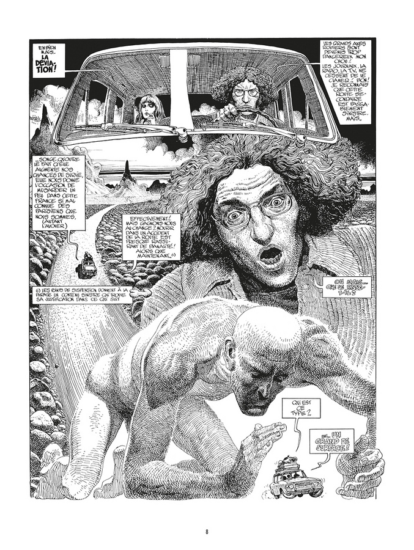
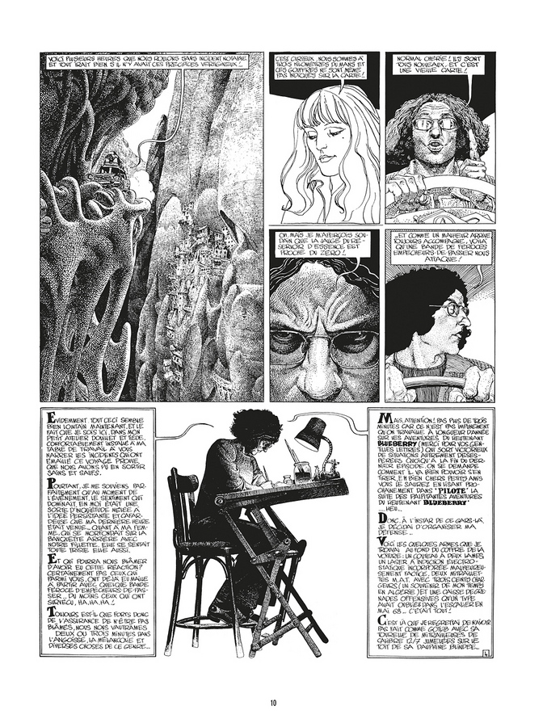

[Chemins qui ne mènent nulle part]{.smallcaps}\
\
--- [@rilke_les_2005]

Remerciements {#remerciements .unnumbered}
-------------

Je remercie toutes les personnes ayant été présente lors de la rédaction
de ce mémoire\
Document en cours de construction\

# [Avant-Propos](FrontBackMatter\AvantPropos.md)

# Index

## Introduction

## Espace de la Bifurcation

- #### [La carte : dimension heuristique de la Bifurcation](Chapters\Chapter01.md)

- #### [Logique et sémantique de la Bifurcation](Chapters\Chapter02.md)

Questionner le paradigme de la singularité
==========================================

État et passage au sein d'une Bifurcation {#ch:chap_three}
-----------------------------------------

Document en cours de construction\

Détour sans détour, paradoxe de la singularité {#ch:chap_four}
----------------------------------------------

Document en cours de construction\

Étre différent mais relié
=========================

Complexe et décentralisation {#ch:chap_five}
----------------------------

Document en cours de construction\

Comment ne pas suivre le chemin {#ch:chap_six}
-------------------------------

Document en cours de construction\

Conclusion
==========

Appendix
========

Documents Annexe
----------------

### Mille Plateau [@deleuze_mille_1980] {#a_plateau}

<https://cequisecret.net/sites/secret/public/pdf/Mille-Plateaux-Gilles_Deleuze.pdf>Mille
Plateau

### Proust et la digression [@bayard_hors-sujet_1996] {#a_proust}

<http://excerpts.numilog.com/books/9782707315779.pdf>Proust et la
digression

### La Relation comme forme [@boissier_relation_2008] {#a_forme}

<https://www.lespressesdureel.com/file/ouvrage/1407/extrait_pdf_1407.pdf>La
Relation comme forme

### Les carnets de recherche en ligne [@dacos_les_2010] {#a_carnet}

<https://archivesic.ccsd.cnrs.fr/sic_00439849/document>Les carnets de
recherche en ligne

### Balzac et la digression [@deruelle_balzac_2004] {#a_balzac}

<https://www.cairn.info/revue-l-annee-balzacienne-2006-1-page-379.htm?contenu=article>Balzac
et la digression

### Les Gommes [@robbe-grillet_les_2010] {#a_gomme}

<http://www.leseditionsdeminuit.fr/images/extrait_1795.pdf>Les Gommes

### Enseigner et Apprendre [@filliou_enseigner_1998] {#a_filliou}

<https://monoskop.org/images/5/59/Filliou_Robert_Enseigner_et_apprendre_arts_vivants_1998.pdf>Enseigner
et Apprendre

### Generative Adversarial Network[@goodfellow_generative_2014] {#a_gan}

<https://papers.nips.cc/paper/5423-generative-adversarial-nets.pdf>Generative
Adversarial Network

### Esthétique post-média[@manovich_esthetique_2017] {#a_post}

<https://journals.openedition.org/appareil/2394>Esthétique post-média

### Le langage des nouveaux média[@manovitch_langage_2015] {#a_new}

<https://journals.openedition.org/questionsdecommunication/5949>Le
langage des nouveaux média

### L'écriture digressive d'Éric Chevillard [@maziarczyk_les_2018] {#a_non}

<http://cejsh.icm.edu.pl/cejsh/element/bwmeta1.element.desklight-eb629089-7564-446f-bdca-a06aa638aa88>L'écriture
digressive d'Éric Chevillard

### L'Hypothèse de Robert Pinget [@patron_hypothese_1995] {#a_pinget}

<https://www.persee.fr/doc/litt_0047-4800_1995_num_97_1_2360>L'Hypothèse
de Robert Pinget

### Stratégies discursives [@sabry_strategies_1992] {#a_pinget}

<https://www.persee.fr/doc/mots_0243-6450_1994_num_39_1_1901?q=balzac+et+la+digression>Stratégies
discursives

### Théorie de la Communication [@shannon_mathematical_1998] {#a_shannon}

<http://capesdocte.wdfiles.com/local--files/fiches/Watzlawick_P_logique_communication.pdf>Théorie
de la Communication

### Sortir de l'Anthropocène [@stiegler_sortir_2015] {#a_sortir}

<https://www.cairn.info/revue-multitudes-2015-3-page-137.htm>Sortir de
l'Anthropocène

### Qu'appelle-t-on panser ? [@stiegler_quappelle-t-panser_2018] {#a_panser}

<https://excerpts.numilog.com/books/9791020905505.pdf>Qu'appelle-t-on
panser ?

### abstractmachine.net [@noauthor_abstractmachine_nodate] {#a_panser}

<https://www.abstractmachine.net/>abstractmachine.net

### La Déviation - Moebius [@moebius_deviation_1980] {#a_moebius}

 

### Budapest ou presque [@nine_budapest_2019] {#a_nine}

Document en cours de construction\

[\[app:bibliography\]]{#app:bibliography label="app:bibliography"}

### Colophon {#colophon .unnumbered}

Ce document a été composé grâce à la feuille de style typographique
`classicthesis` conçue by André Miede. L'aspect visuel est inspiré du
très estimé Robert Bringhurst dans son livre de typographie : "*The
Elements of Typographic Style*". `classicthesis` est disponible pour
tout les éditeurs et les distributions LaTeX et également pour le
programme L-.1667em.25emY-.125emX:

<https://bitbucket.org/amiede/classicthesis/>

Certains utilsateurs de `classicthesis` ont déjà envoyé une carte
postale à l'auteur, nombre de ces exemplaires sont compilés ici:

<http://postcards.miede.de/>
