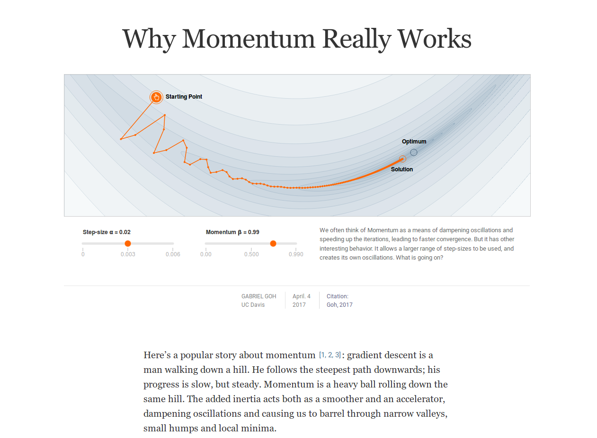
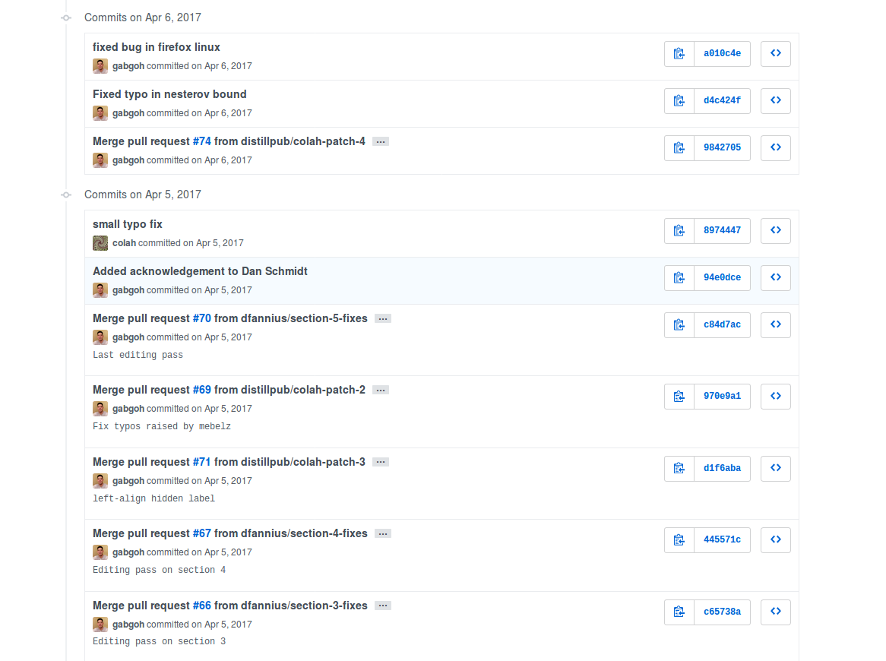
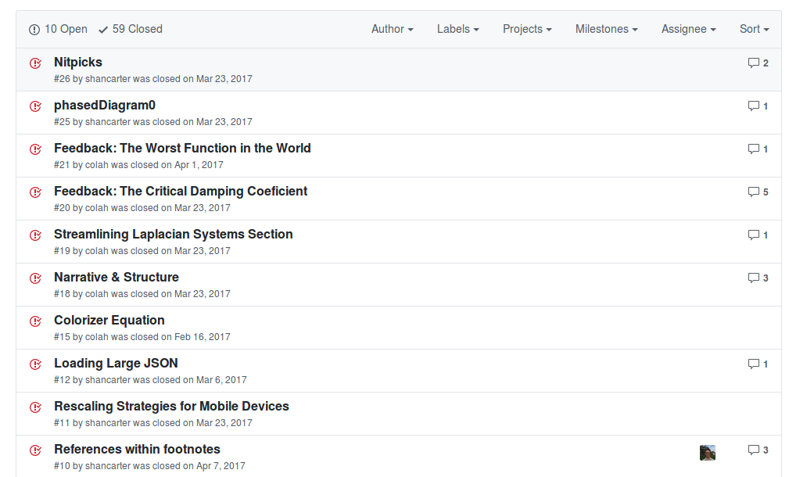

# Analyse d'objet : la revue académique Distill

## Une nouvelle revue dans le domaine du "machine learning"
_Distill_, ou Distill.pub, fait son apparition en 2017 dans le domaine de la recherche en _machine learning_ – ou apprentissage automatique en français.
Cette revue académique, qui présente des recherches et des résultats en intelligence artificielle uniquement en version web, apparaît dans un paysage particulier.
Le domaine du _machine learning_ semble souffrir d'un manque d'articles de bonne qualité en terme de démonstration, de rédaction et de présentation.
_Distill_ entend réduire la _dette_ produite par les trop nombreux articles de mauvaise qualité – toujours sur le plan de la communication (Olah et Carter, 2017).

La principale originalité de la revue _Distill_ est de proposer une version web intégrant des schémas interactifs.
Ici pas de format PDF figé et souvent peu propice à comprendre des concepts basés sur des éléments dynamiques.
L'édition universitaire reste encore dominée par des schémas qui ne correspondent plus à l'environnement numérique dans lequel nous vivons : l'imprimé reste la norme alors qu'un soin particulier serait nécessaire pour permettre aux versions numériques d'être lisibles (Masure, 2018).
Chaque schéma ou diagramme des _papiers_ de _Distill_ est interactif : les données peuvent être modifiées pour visualiser directement des résultats de recherche.
En modifiant ces paramètres le lecteur est plus à même de comprendre les raisonnements des chercheurs, de se les approprier, et de chercher un peu, à son échelle.
Ces outils ont même une nouvelle vertu : vulgariser la recherche scientifique.
Sur ce point il ne faut pas oublier quel est le sujet de la revue – l'intelligence artificielle – et quel organisme porte le projet – Google Brain : les questions de la diffusion et de l'image sont essentielles.

  
_Capture d'écran d'un article de la revue Distill, avec le titre, un schéma interactif et le début de l'article_

## Nativement numérique
Chaque article est donc lisible directement en ligne : la revue est _nativement_ numérique et même disponible uniquement sous cette forme.
Nous sommes ici dans un modèle dit de l'Open Access, puisque les contenus sont librement consultables, placés sous licence Creative Commons BY[^distill-cc-by] et référencés avec un identifiant DOI.
Et, précision importante en terme d'accès, il n'est pas nécessaire de télécharger un fichier au format PDF pour consulter un article complet.
Les lecteurs ont _simplement_ besoin d'une connexion internet et d'un navigateur web pour lire _Distill_.
Ce dernier point est primordial en terme de diffusion de la connaissance.

La disponibilité en ligne et les schémas interactifs ne sont pas les seuls caractères qui font de cette revue un objet résolument numérique.
Plusieurs fonctionnalités viennent s'ajouter aux questions d'accès et de visualisation :

- chaque article est une page web qui comporte des métadonnées très riches, permettant à la fois un référencement mais aussi une intégration dans des outils de gestion bibliographique comme Zotero (Fauchié, 2018) ;
- toujours sur ces enjeux de métadonnées, des indications figurent à la fin de chaque article pour les citer correctement, et notamment une notice BibTeX ;
- les notes et références apparaissent au passage du curseur, tout en étant disponibles en bas de page, ce qui facilite la lecture.

Le texte se mêle à des graphiques dont les variables peuvent être modifiées, les lecteurs ne sont plus passifs mais ont la possibilité de manipuler l'objet des recherches exposées dans les articles.
En plus de faciliter la lecture, les sources des articles de _Distill_ sont disponibles sur un dépôt GitHub.
Chaque article est ainsi constitué d'un ensemble de fichiers – dont du HTML pour le texte – mis à disposition publiquement.

  
_Capture d'écran du dépôt d'un article de la revue Distill sur la plate-forme GitHub, avec la liste des fichiers et dossiers, et d'autres informations_

## Versionner les contenus
Pourquoi rendre accessibles les _sources_ des articles ?
Pour deux raisons :

- probablement dans l'optique de montrer les _dessous_ de la recherche, plutôt à des fins pédagogiques que de transparence ;
- pour _versionner_ les contenus et donner à voir l'historique des articles.

Versionner les contenus ?
GitHub est une plateforme qui héberge des projets utilisant le système de gestion de versions Git.
Chaque modification ou série de modifications fait l'objet d'un _commit_, et chaque _commit_ est accompagné d'un message.
À partir des _commits_ il est ainsi très facile de voir la progression d'un projet, les phases de correction, les ajouts, etc.
Git est utilisé pour gérer du code informatique, mais Git peut également permettre de versionner du texte et garder trace de modifications successives.
C'est le cas de cette revue, c'est également le cas pour ce mémoire qui est versionné avec Git et disponible sur un dépôt public hébergé par GitLab[^depot-memoire].
Sur le dépôt d'un article de _Distill_ sur GitHub, il est possible de voir les différentes modifications et les différents intervenants d'un projet.
La révision des articles est publique, ce qui semble très loin des pratiques classiques dans le monde académique.

  
_Capture d'écran de commits pour un article de la revue Distill sur la plate-forme GitHub_

Cette façon de rendre compte d'une recherche qui se construit est nouvelle dans le domaine de la publication universitaire, ou même plus globalement pour la recherche universitaire : les sources sont mises à disposition, et l'historique des modifications est également consultable.
Par ailleurs cela implique que chaque article continue de _vivre_ même après publication : par exemple un article publié en avril 2017 peut encore avoir des modifications en mai 2018.
Cette double ouverture, à la fois montrer et faire évoluer, est une influence du monde de la programmation.
Prenons l'exemple d'un site web : il peut effectivement évoluer continuellement, jour après jour, tant sur les contenus que sur son architecture technique.

_Distill_ va même jusqu'à imposer ce fonctionnement aux auteurs.
Dans le cas de soumissions d'articles les auteurs doivent créer un dépôt GitHub et le proposer aux éditeurs de la revue pour commentaire et correction.
Les révisions sont alors _versionnées_, et publiques si l'article est accepté.
Enfin, _Distill_ utilise Git et les fonctionnalités de l'écosystème de GitHub : n'importe qui peut proposer des modifications sous réserve qu'elles soient ensuite validées ; les personnes ne souhaitant pas intervenir directement peuvent ouvrir une _issue_ – ou ticket en français – pour partager leurs remarques.

  
_Capture d'écran de certaines issues pour un article de la revue Distill sur la plate-forme GitHub_

## Un modèle bienvenu qui questionne
L'arrivée de _Distill_ semble avoir été très bien accueillie, plusieurs articles en attestent[^distill-accueil].
Comme nous l'avons déjà dit il semble que la revue vienne combler un vrai manque dans le domaine.
Par ailleurs le fonctionnement global de la revue – sources et révisions publiques, contenus versionnés, métadonnées riches – aura sans aucun doute des répercussions sur les pratiques éditoriales de certains domaines académiques, ou tout du moins nous pouvons l'espérer.

Si ce modèle original est bienvenu, il pose néanmoins un certain nombre de questions que nous allons aborder, en majorité réunies dans un article de David Rosenthal (Rosenthal, 2017).

Premièrement, est-il tout de même possible de consulter les articles autrement que _en ligne_ ?
Les pages web qui constituent les articles peuvent être imprimées.
L'intérêt est limité, puisque les schémas ne sont plus disponibles, mais il est possible de disposer d'une version statique et dégradée au format PDF ou sous forme imprimée.

Deuxièmement, un article qui peut sans cesse être modifié peut-il être raisonnablement cité ?
Comme nous l'avons exposé, les contenus de _Distill_ peuvent connaître des évolutions même après publication.
La recherche académique étant basée sur le lien entre des publications, que se passe-t-il si un article est cité puis modifié ?
Est-ce que le passage de l'article ainsi modifié ne remet pas en question son lien avec l'article qui le cite ?
Est-ce que l'auteur de l'article qui cite cette source ne risque pas de voir son raisonnement remis en cause ?
Nous ne pouvons proposer de solution ici, si ce n'est qu'en plus de la référence bibliographique classique, la _version_ citée pourrait être précisée, par exemple avec l'identifiant du _commit_ correspondant[^commit-detail].

Deux questions techniques viennent s'ajouter : la pérennité et l'archivage.
Comment assurer une pérennité d'accès aux articles ?
Ces derniers nécessitent un serveur web et un ensemble de composants pour pouvoir être consultés.
Par rapport à un fichier PDF qui ne demande que peu de contraintes techniques, comment gérer une revue comme _Distill_ dans le temps long ?
Si les versions et les échanges sont disponibles sur GitHub – sous forme de commits liés à Git mais aussi d'_issues_ dépendantes directement de la plate-forme GitHub – que se passe-t-il si GitHub cesse ses services ?
L'archivage est une problématique essentielle dans le domaine de la recherche.

Enfin apparaît en fond une question essentielle sur la légitimité de la revue : si la majorité des éditeurs sont des employés de Google, et que les principaux investissements proviennent également de cette entreprise, qu'est-ce qui peut garantir une intégrité intellectuelle à _Distill_ ?
Si la revue a connu une couverture médiatique importante au moment de son lancement, il semble que des moyens importants ont été placés dans la stratégie marketing.

_Distill_ représente un nouveau modèle de publication scientifique, mêlant  des visualisations interactives, proposant une lecture profondément numérique et adoptant une dimension résolument réinscriptible (Dacos, 2009).
Ce modèle interroge les pratiques de publication universitaire, à la fois sur la lisibilité des résultats de la recherche, sur les façons de produire ces articles académiques et sur la façon d'inclure les différents intervenants de la recherche dans un projet commun.
Envisager le versionnement pour l'édition, n'est-ce pas là l'occasion de repenser la façon de gérer la fabrication d'un texte ou d'un livre ?

[^distill-cc-by]: Cela signifie que la seule obligation dans le cadre d'une réutilisation est celle d'indiquer la paternité, les modifications sont autorisées.
[^depot-memoire]: Le dépôt de ce mémoire est disponible à l'adresse suivante : [https://gitlab.com/antoinentl/systeme-modulaire-de-publication/](https://gitlab.com/antoinentl/systeme-modulaire-de-publication/)
[^distill-accueil]: De nombreux articles souvent élogieux ont été publiés au moment du lancement de la revue, comme en atteste [ce résultat de recherche](https://www.google.com/search?q=distill%20journal&hl=fr&source=lnt&tbs=cdr%3A1%2Ccd_min%3A2%2F1%2F2017%2Ccd_max%3A9%2F30%2F2017&tbm=).
[^commit-detail]: Un _commit_ est un enregistrement accompagné d'un message, un _commit_ correspond à un état d'un projet géré avec Git.
