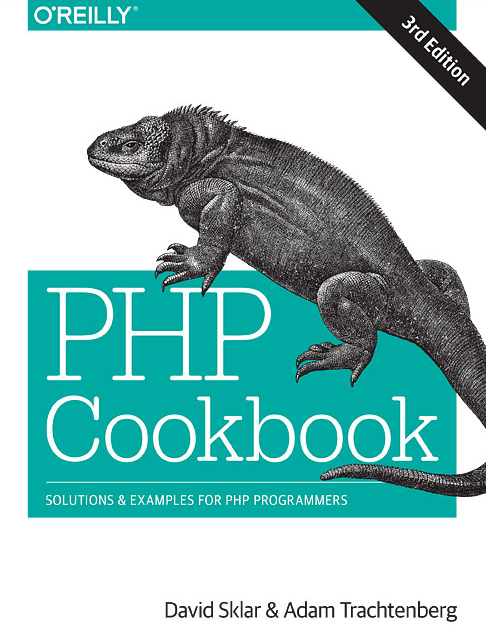
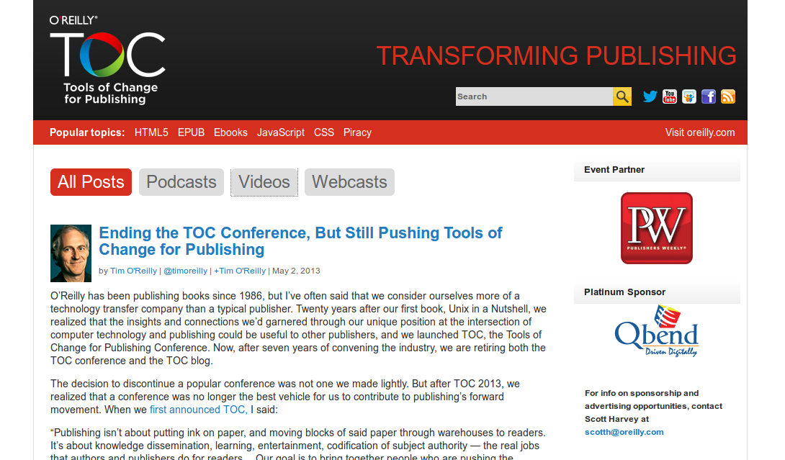
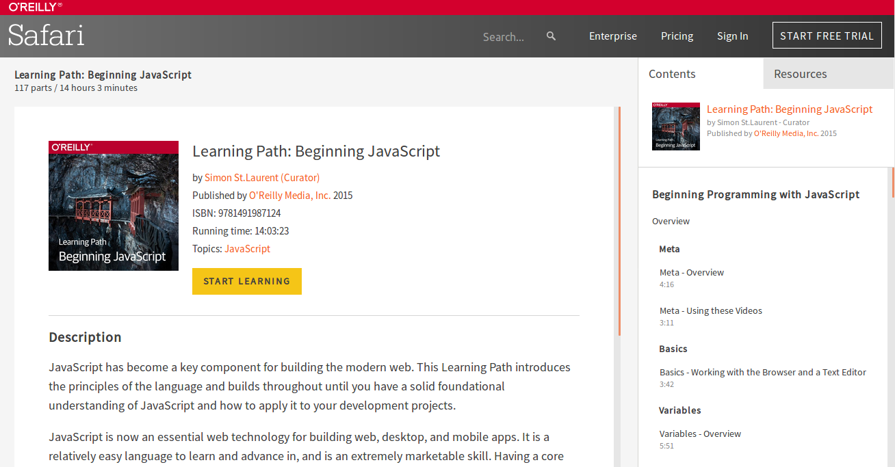

# Analyse d'objet : la chaîne de publication d'O'Reilly

### L'ambition du savoir numérique
O'Reilly Media est une maison d'édition fondée par Tim O'Reilly qui publie des livres sur l'informatique depuis la fin des années 1970. Tim O'Reilly est un auteur, éditeur et entrepreneur américain d'origine irlandaise, il est notamment connu comme défenseur de l'open source ou encore comme figure du domaine des nouvelles technologies en Californie, il s'est fait connaître en dehors de ce milieu avec le concept de "web 2.0".
O'Reilly Media est devenue un acteur incontournable du milieu technique international – dont la Silicon Valley est l'une des incarnations la plus forte –, à travers des publications, des conférences, des vidéos, des cours en ligne, des sites web, des expérimentations, etc. Producteur et diffuseur de savoir dans les domaines de l'informatique, du numérique, du web et des technologies émergentes, les livres ne sont plus l'objet unique de cet éditeur singulier, ils sont le point de départ vers de nombreux *produits* pédagogiques destinés à des professionnels.

  
*Une couverture d'un livre publié par O'Reilly Media, avec l'animal emblématique de cette collection*

L'ambition d'O'Reilly est de réunir un ensemble de références autour du savoir numérique. Par son caractère ouvert, horizontal et global, cette entreprise pourrait être qualifiée d'*encyclopédie 2.0* – Tim O'Reilly a diffusé le concept de *web 2.0* inventé par Dale Dougherty en 2003, concept qui a marqué la décennie 2000, mais qui est désormais révolu. Les outils de publication d'O'Reilly Media sont forcément influencés par cet univers technique et technophile : publier des livres techniques implique de choisir ses outils de publication avec soin, et même d'intégrer la question de la technique dans la façon de faire les livres, et pas uniquement dans les contenus. En une trentaine d'année, O'Reilly a développé une série d'outils et de méthodes pour créer des livres, les publier et les diffuser.

### Fluidifier les échanges
En terme d'échanges avec les auteurs, O'Reilly a très tôt ouvert la possibilité d'intégrer, dans son workflow, différents formats : Word ou OpenOffice avec une certaine feuille de style, mais également des formats plus utilisés par les communautés techniques comme LaTeX ou HTML par exemple. Il s'agit d'une démarche d'ouverture, ainsi que d'une volonté de rendre cohérente l'activité de publication avec le sujet des livres édités, tout en prenant soin des auteurs.

Pour fabriquer ses livres, O'Reilly a utilisé le format XML – ce format permet une structuration fine des contenus, et il est souvent accompagné d'une DTD, définition de type de document. O'Reilly a fait le choix de [DocBook](http://docbook.org/) pour sa DTD, dont il est l'un des créateurs et mainteneurs. DocBook est pensé pour les contenus à caractère technique, il permet notamment une gestion des formules mathématiques et du code informatique *dans* les publications.
Ce format XML est le point de départ pour la génération de différents formats : EPUB pour les livres numériques, PDF pour une consultation numérique, des fichiers HTML pour les versions web, et une intégration dans InDesign pour l'impression papier. En plus de sa fonction *pivot*, XML DocBook peut être utilisé par les auteurs lors de l'écriture, avec un éditeur XML adapté.
Cette DTD est aussi puissante que complexe, c'est probablement pour cette raison qu'elle est peu utilisée lors de l'étape d'écriture. [AsciiDoc](http://asciidoc.org/) a été conçu pour remédier à cela, c'est à la fois un langage de balisage léger et une chaîne de publication, AsciiDoc est un héritier de DocBook : transformation du format .adoc en HTML, en XML DocBook évidemment, mais également en odt, en EPUB ou en PDF. Plusieurs livres publiés par O'Reilly Media ont été écrits avec AsciiDoc.

La recherche d'un format pivot a comme objectif de fluidifier les échanges entre auteurs, éditeurs et les autres acteurs de la chaîne d'édition. Faciliter l'écriture, faciliter la production des formats, mais surtout gagner un temps précieux pour se concentrer sur les contenus, et pour réduire les coûts de production des livres.

### Évangéliser autour de standards
Si O'Reilly soutient le schéma DocBook par son implication dans le maintien du format, et à travers la publication d'un guide à destination des professionnels[^doc-book], la limite de ce format XML est sa complexité intrinsèque, et le manque d'adhésion qu'il a suscité. Avec [HTMLBook](https://oreillymedia.github.io/HTMLBook/), un format basé sur HTML5, O'Reilly entend pérenniser un standard pour la publication, et augmenter la visibilité d'un tel format.

Les recherches d'O'Reilly sur les outils de publication ne concernent pas que ses propres intérêts : il s'agit également d'accompagner d'autres maisons d'édition et de réfléchir à leurs outils et leurs méthodes de publication. Dès 2007, O'Reilly Media initie Tools of Change for Publishing – ou TOC[^toc] –, une série de conférences à fréquence et localisations variables. En quelques années TOC est devenu l'événement incontournable pour le milieu de l'édition et du livre numérique.
Retours d'expérience, présentations d'expérimentations, ateliers, débats, temps de rencontre, TOC a permis à une industrie de se retrouver, d'échanger, et d'avancer ensemble au moment de l'émergence et du déploiement du livre numérique aux États-Unis et en Europe. Observatoire idéal pour O'Reilly Media, certaines évolutions de ses outils de publication ont peut-être bénéficié de ces rencontres et présentations.

  
*Capture d'écran du site consacré à Tools of Change for Publishing*

En faisant le choix d'un format plus pérenne et mieux accepté par la communauté, et en organisant un événement central, O'Reilly a réellement enclenché une évangélisation autour des outils de publication – le terme *évangélisation* est volontairement utilisé ici pour signaler la position hégémonique qu'occupe O'Reilly dans le domaine de l'édition technique.

### Au-delà du texte
En 2001 O'Reilly ouvre la plateforme Safari Books Online, en collaboration avec Pearson Technology Group jusqu'en 2004[^safari]. Bibliothèque numérique, Safari regroupe des livres numériques d'O'Reilly, des publications d'autres éditeurs des domaines de l'informatique et du numérique, et des vidéos.
En 2013 O'Reilly communique sur Atlas, une plateforme d'édition, d'abord conçue pour créer des livres numériques. Atlas réunit plusieurs composants déjà utilisés par la maison d'édition : HTMLBook que nous avons déjà évoqué, ou Git qui est un logiciel de gestion de versions largement utilisé dans le domaine informatique. D'un côté Atlas pour faciliter l'écriture et l'édition, de l'autre Safari pour diffuser et commercialiser.
Le choix récent d'O'Reilly d'arrêter de vendre des livres au format numérique à l'unité[^end-epub] rentre pleinement dans cette stratégie d'efficacité et d'économie – privilégier un seul canal de distribution et limiter les coûts.

  
*Capture d'écran du site Safari d'O'Reilly*

Le livre n'est qu'une porte d'entrée vers d'autres contenus, l'objectif final est bien la diffusion d'un savoir technique : toute la chaîne de production et de diffusion est pensée pour proposer la forme la plus adaptée des contenus. O'Reilly a très vite envisagé son activité de publication et de diffusion au-delà du texte, notamment parce que l'abonnement à des cours en ligne représente une rentabilité plus importante que la vente de livres papier, d'autant plus si les vidéos s'appuient sur les livres. Les choix techniques sont intrinsèquement liés au texte et au livre, gérés comme du code : mise en place d'un standard pour structurer les contenus, outil de version pour manipuler du texte à plusieurs, facilité de mise à jour, etc.

Nous pouvons supposer que cette organisation – des standards pour structurer les contenus et pour gérer le texte, et le développement de plateformes pour maîtriser chaque étape de la chaîne d'édition – a été mise en place pour trois raisons : offrir une forte visibilité des contenus au-delà du format *livre* avec Safari Books Online ; accroître la rentabilité en industrialisant la chaîne de publication dans une recherche d'efficacité maximale, avec la plateforme Atlas ; bâtir une cohérence entre l'activité de publication et le domaine d'édition, l'informatique. O'Reilly Media est un exemple caractéritique de l'enjeu et de la complexité des questions et des choix techniques dans une activité de publication, ainsi que de l'évolution des processus d'édition.

[^doc-book]: WALSH, Norman. *DocBook 5: The Definitive Guide*. Sebastopol (Calif.) : O'Reilly, 2010.
[^end-epub]: FOMOOK, John. We're reinventing, too. *O'Reilly Media* [en ligne]. 29 juin 2017. [Consulté le 8 août 2017]. Disponible à l'adresse : https://www.oreilly.com/ideas/were-reinventing-too
[^toc]: Le site web Tools of Change for Publishing est toujours consultable et il contient de nombreux contenus. Disponible à l'adresse : http://toc.oreilly.com/
[^safari]: Safari Books Online. *Wikipédia* [en ligne]. 2017. [Consulté le 16 octobre 2017]. Disponible à l'adresse : https://en.wikipedia.org/wiki/Safari_Books_Online
