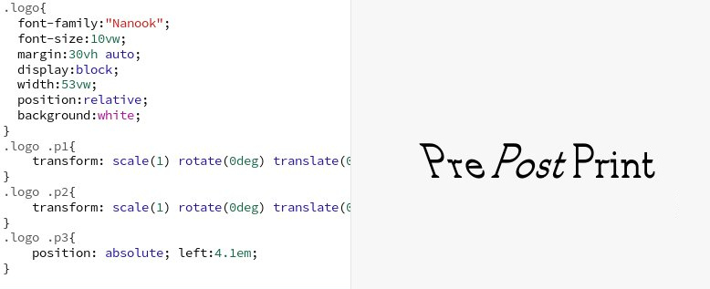
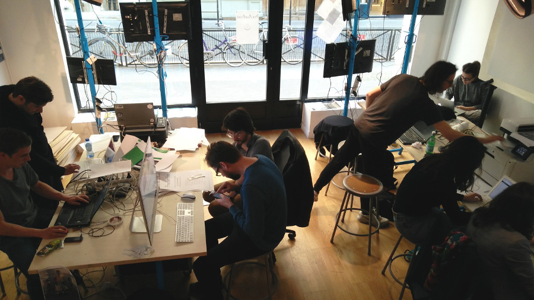
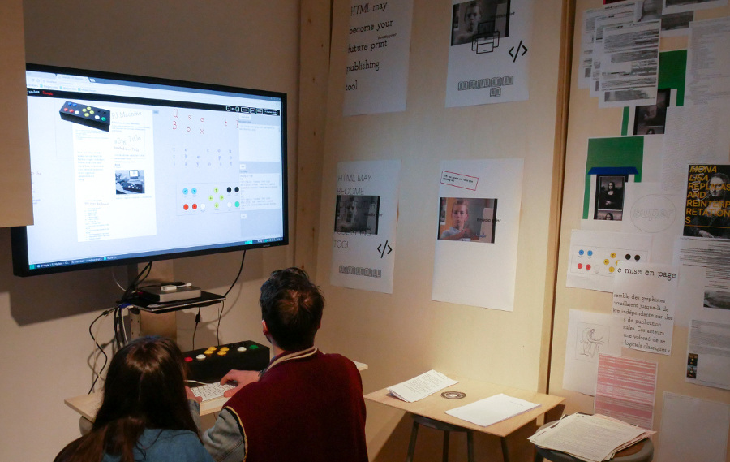
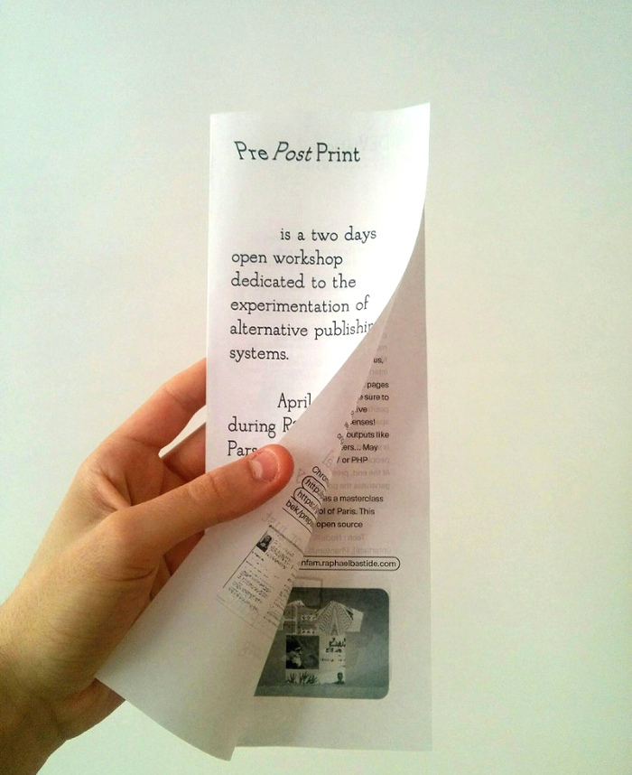
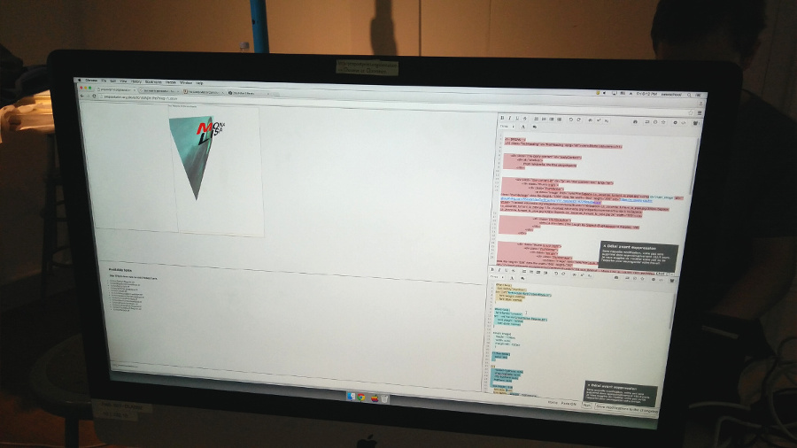

# Analyse du workshop PrePostPrint

# Chercher, manipuler, partager, imprimer, Retour sur le premier workshop de PrePostPrint

L'initiative PrePostPrint est née d'un constat : les logiciels traditionnels de mise en page et d'édition sont figés, fermés, souvent coûteux, cloisonnés et cloisonnants, et parfois peu ergonomiques. Il est nécessaire d'envisager des technologies plus accessibles et conviviales, pouvant évoluer et s’adapter à chaque projet. Ainsi [Sarah Garcin](http://sarahgarcin.com/) et [Raphaël Bastide](http://raphaelbastide.com/), deux designers graphiques aux pratiques numériquement libres, ont décidé de constituer un collectif dont les membres et les projets sont à géométrie variable. Rassembler les énergies déployées autour de la création et de l'usage d'outils alternatifs de publication, voilà l'ambition de [PrePostPrint](http://prepostprint.org/).

  
*Le logo de PrePostPrint et le code associé*

Le premier workshop de ce groupe de recherche s'est déroulé les 6 et 7 avril 2017 au sein de l'école de design américaine [Parsons Paris](http://www.newschool.edu/parsons-paris/). L'objectif de ce premier événement organisé par PrePostPrint était double : présenter des projets permettant de concevoir et de fabriquer des objets imprimés *autrement*, et offrir un temps et un espace d'échange autour de ces pratiques. Le public était donc naturellement mélangé : tout autant des *praticiens* que des *chercheurs*, même si les profils étaient majoritairement mixtes.
À plus long terme PrePostPrint souhaite également porter la voix de ces initiatives, notamment en cherchant les solutions les plus à même de répondre aux contraintes de la démarche HTML2Print ou Web2Print – remplacer les logiciels classiques de mise en page par le duo HTML et CSS, donc en imprimant une page web.

Quatre projets de publication expérimentale étaient présentés et manipulables. Les participants – composés de designers, de chercheurs, d'enseignants et d'étudiants – ont pu éprouver de nouvelles façons de concevoir et de produire des documents, et échanger autour des enjeux de ces méthodes alternatives. Trois dispositifs de ce workshop permettaient d'exploiter les possibilités de l’association d'HTML et de CSS pour des publications imprimées.

  
*Photo prise pendant le workshop*

## PJ Machine
La PJ Machine[^pj-machine] est une installation ludique composée d'une console, d'un écran et d'un logiciel. Cette "Publishing Jockey Machine" conçue par Sarah Garcin propose une approche originale de la composition graphique. Chaque bloc est positionnable et ajustable grâce aux boutons de la console : alignements vertical et horizontal, largeur des blocs, espacement des textes, et export au format PDF. Cet outil repose sur l'utilisation d'HTML et de CSS. Les blocs sont des éléments d'une page HTML, le PDF est fabriqué grâce aux propriétés CSS pour l'impression – aussi appelées CSS Print.
Les utilisateurs de passage ont principalement découvert une nouvelle façon de composer une page, pour créer un poster ou un flyer, et ainsi d'oublier les réflexes liés à des approches et des logiciels plus conventionnels.
Très facile d'accès – les principales interactions consistent à appuyer sur des boutons avec un contrôle visuel –, la PJ Machine a été détournée afin d'intégrer un caractère aléatoire : certains contenus ou détails de la mise en forme étaient modifiés à chaque génération du PDF, via l'utilisation de quelques lignes de JavaScript. Les testeurs ont pu créer des affiches et des flyers originaux, ou reprendre les travaux entrepris pendant le workshop.

  
*Deux testeurs du dispositif PJ Machine de Sarah Garcin*

## Un flyer sous forme de page web
Raphaël Bastide a également utilisé les propriétés CSS Print pour transformer la page web de [PrePostPrint](http://prepostprint.org/) en flyer – un format A4 en trois parties, visible ci-dessous. L'objectif de cette démarche était de démontrer comment un même contenu au même format peut se décliner en web et en imprimé.
La page web *déroulable*, accessible via un ordinateur, un téléphone ou une tablette, devient un objet de papier consultable sans électricité ou connexion internet. Le même contenu a deux formes différentes mais complémentaires, elles sont produites par le même outil : un navigateur web, connecté à internet d'un côté, et capable de générer un PDF de l'autre. Il n'y a pas la nécessité d'utiliser plusieurs logiciels, d'effectuer des opérations complexes pour passer d'une version "numérique" à un fichier imprimable, mais simplement du logiciel le plus utilisé : un navigateur web.
Comme dans certains usages de la PJ Machine de Sarah Garcin, Raphaël Bastide a ajouté un élément aléatoire sur la page web et le flyer imprimable, vous pouvez le découvrir en rafraîchissant la page de présentation du workshop[^workshop-ppp].

  
*Impression de la page web prepostprint.org : un flyer en trois volets*

Ce premier workshop de PrePostPrint était l'occasion d'accueillir deux designers, Étienne Ozeray et Romain Marula de l'[Atelier Bek](http://www.atelier-bek.be/), et de tester leur dispositif DEViation. Invitation à la collaboration et à la découverte, DEViation est l'association de plusieurs éléments : deux "pads" ou éditeurs de texte en ligne ouverts à tous, pour le contenu d'un ĉoté et la mise en forme de l'autre ; une même interface web qui regroupe les deux pads et un aperçu du rendu des pages ; et la génération d'un PDF à partir de la page HTML et de la feuille de style CSS correspondante[^deviation].
Pendant PrePostPrint Étienne Ozeray et Romain Marula avaient pris comme contenu la page Wikipédia "Mona Lisa replicas and reinterpretations"[^mona-lisa], consacrée aux nombreuses répliques et réinterprétations de la Joconde de Léonard de Vinci comme son nom l'indique – clin d'œil assumé au dispositif. Même si la règle n'a heureusement pas été respectée, l'objectif de départ était de ne pas modifier le contenu de la page – le pad dédié à la structure et donc au HTML –, mais uniquement la mise en forme – le pad dédié au CSS. Plusieurs personnes pouvaient intervenir simultanément sur une même page, sur place à l'école, ou à distance, engendrant de multiples mises en forme de la page.
Régulièrement les deux designers graphiques imprimaient les résultats et les exposaient sur la vitrine ou sur les murs de l'école. Nous avons pu découvrir des grammaires graphiques originales, des expérimentations basées sur l'effacement de certaines parties, des reprises de création connues ou observer en direct des influences et des croisements entre deux utilisateurs. Ces créations graphiques, en partie éphémères – en partie seulement car Étienne Ozeray et Romain Marula avaient la capacité d'enregistrer les pads à tout moment, mais pas de façon automatisée –, ont rendu possible un champ créatif et de nombreuses discussions à la fois techniques – comment réaliser en CSS tel effet – et graphiques.

  
*Un aperçu de l'interface de DEViation*

"Peut-on réinventer une chaîne graphique ouverte, permettant à partir d'une seule source, de publier sur une multitude de supports, assurant ainsi l'autonomie de ses acteurs ?" Cette interrogation de Raphaël Bastide et Sarah Garcin fait écho à de nombreuses expérimentations en cours, celle d'Open Source Publishing[^4] est sans doute la plus emblématique : utiliser quelques lignes de code – HTML et CSS – plutôt que des logiciels fermés et cloisonnants.
Ce workshop a permis de détourner les technologies du web pour façonner des documents imprimés, et de privilégier l'expérimentation à l'efficacité. Projet politique, ouvert, enthousiasmant et rafraîchissant, PrePostPrint offre la possibilité de ne plus subir mais de prendre en main, de transformer et de collaborer.

  
*Quelques pages créées avec DEViation pendant le workshop*

[^pj-machine]: GARCIN, Sarah. pj-machine: A live publishing tool. *GitHub* [en ligne]. 2017. [Consulté le 8 août 2017]. Disponible à l'adresse : https://github.com/sarahgarcin/pj-machine/
[^workshop-ppp]: PrePostPrint [en ligne]. 2017. Disponible à l'adresse : https://prepostprint.org/parsons/
[^deviation]: OZERAY, Étienne. MARULA, Romain. prepostprint. *GitLab* [en ligne]. 2017. [Consulté le 8 août 2017]. Disponible à l'adresse : https://gitlab.com/atelier-bek/prepostprint
[^mona-lisa]: Mona Lisa replicas and reinterpretations. *Wikipedia* [en ligne]. 2017. [Consulté le 8 août 2017]. Disponible à l'adresse : https://en.wikipedia.org/wiki/Mona_Lisa_replicas_and_reinterpretations
[^4]: Open Source Publishing. HTML sauce cocktail, sauce à part. *OSP-BLOG* [en ligne]. 15 février 2017. [Consulté le 8 août 2017]. Disponible à l'adresse : http://ospublish.constantvzw.org/blog/news/html-sauce-cocktail-sauce-a-part
